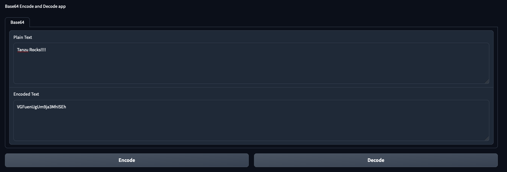

# Base64 App

An Application with the simple purpose of Encoding and Decoding Base64 strings.

The app consists of a API backend, and a UI frontend.
All decoding/encoding happens on the API backend. The UI is only there to tanke inputs, and show the response.

